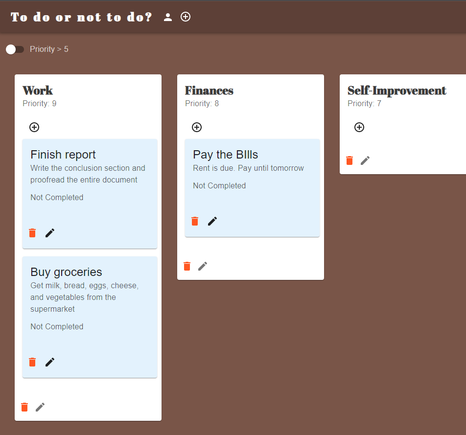

# To-Do-Or-Not-To-Do
Task management full-stack application.  
Still under development.  
Backend written in Rust, Frontend is React + MUI.
Create your own todos, and organize them in todolists with different priorities.  
You can even have the same todo in multiple lists! (Ex: "Collect Garbage" in both "Daily Tasks" and "Help Mom")  

